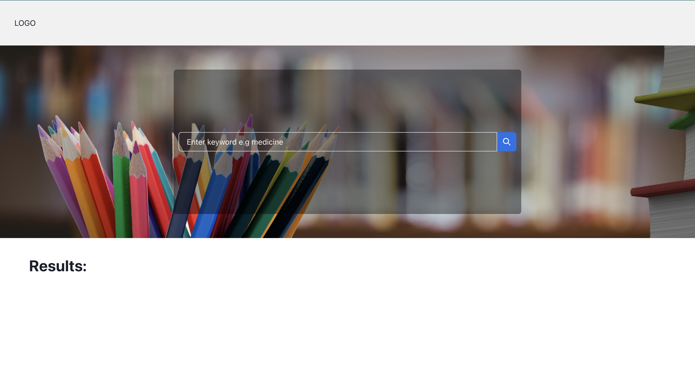
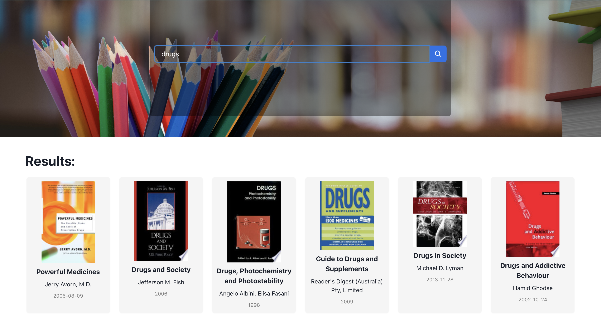
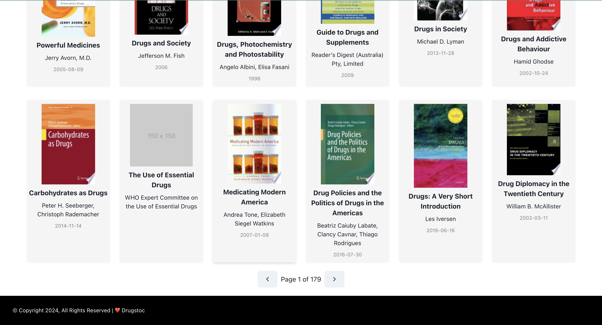
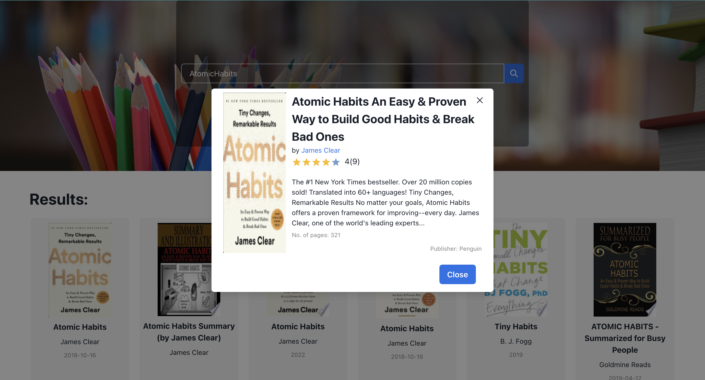

# Autocomplete Component (React)

The `e-library` project is a simple web application that allows users to search for books
using the Google Books API and display the results.


## Features

- **Data Fetching**: Handles data fetching from the Google Books API using axios.
- **Debounced Input**: Integrates with a debouncing mechanism to delay the search operation.
- **Loading Indicator**: Displays a loading message while results are being fetched.
- **Pagination**: Allows for user to browse through paginated results.
- **responsiveness**: Displays the result in a 6-column ngrid on a desktop and a 2-column grid on mobile view.
- **More Details**: Displays more details about the book.


## Demo







## Run Locally

Clone the repository from your terminal

```bash
 git clone https://github.com/AdedejiAdelanwa/drugstoc-e-library.git
```

Go to the project directory

```bash
  cd my-project
```

Install dependencies

```bash
  npm install
```

Start the server

```bash
  npm run start
```

## Feedback

If you have any feedback, please reach out to me at adedejiadelanwa@gmail.com

